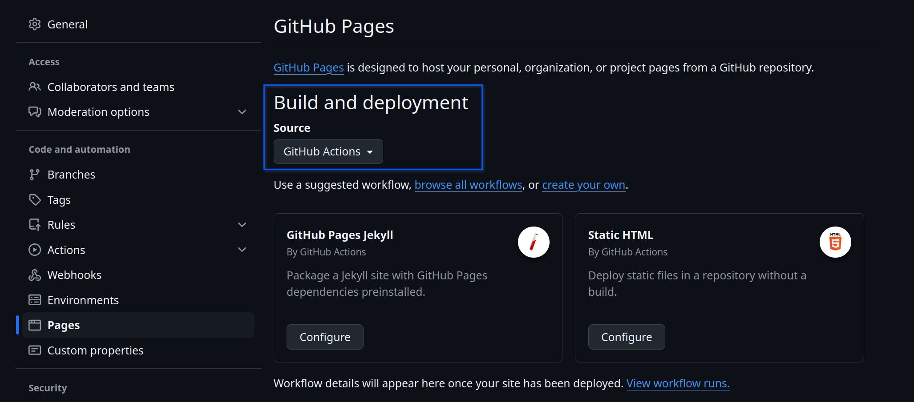
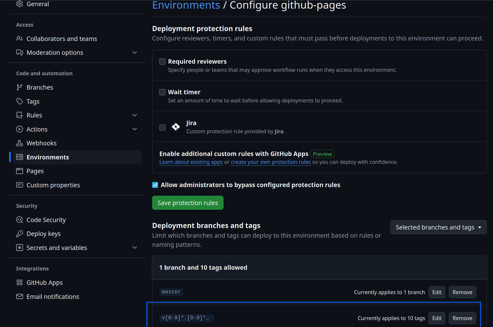

## **_Initial Setup_**

#### if you use GitHub

create a new project using this one as a template.

clone it `git clone <project>` and navigate to the root folder `cd <project>`

add a `.token` file containing your access token to the git repository (allows for git opts to work seamlessly).

run `npm run set-git-auth` to update your repo's git config to include the token

#### If your project has private dependencies or publishes to private npm registries, create an `.npmrc` containing:

```text
@<scope1>:registry=https://<ADDRESS>.com/api/v4/packages/npm/
@<scope2>:registry=https://<ADDRESS>.<DOMAIN>.com/api/v4/packages/npm/
//<ADDRESS>.<DOMAIN>.com/:_authToken=${TOKEN}
//<ADDRESS>.<DOMAIN>.com/api/v4/groups/<GROUP_ID>/packages/npm/:_authToken=${TOKEN}
//<ADDRESS>.<DOMAIN>.com/api/v4/projects/<PROJECT_ID>/packages/npm/:_authToken=${TOKEN}
```

Changing:

- <ADDRESS> to `gitlab` or `github` (or other);
- <DOMAIN> to your domain if any (if you are using plain gitlab or GitHub, remove "<DOMAIN>" and the extra dot);
- <GROUP_ID> to your project's group id (if any). otherwise remove this line
- <PROJECT_ID> to your project's id

### Installation

Run `npm install` (or `npm run do-install` if you have private dependencies and a `.token` file) to install the dependencies:

If this is the first time you are running this command, it will also (according to your choices:

- update this repository's dependencies to their latest version;
- creates the various token files which you can leave empty unless you have private dependencies or publish to private registries
- delete the `postinstall` script from `package.json`;
- try to commit the updated `package.json` and deleted files (having ssh access helps here);

### Scripts

The following npm scripts are available for development:

- `do-install` - sets a `TOKEN` environment variable to the contents of `.token` and runs npm install (useful when you
  have private dependencies);
- `update-scripts`: will pull the GitHub actions, templates, and style configs from the [ts-template](https://github.com/pharmaledgerassoc/ts-template) repository, overwriting the existing.
- `on-first-run`: will run the initial setup script,
- `set-git-auth` - change git config to include the token (no longer requires manual auth). **_Only run once per repository_**;
- `postinstall` - will run only on the first installation to trigger the dep update. Will self-delete;
- `flash-forward` - updates all dependencies. Take care, This may not be desirable is some cases;
- `reset` - updates all dependencies. Take care, This may not be desirable is some cases;
- `build` - builds the code (via gulp `gulpfile.js`) in development mode (generates `lib` and `dist` folder);
- `build:prod` - builds the code (via gulp `gulpfile.js`) in production mode (generates `lib` and `dist` folder);
- `test` - default project test script, defaults to `test:unit`;
- `test:unit` - runs unit tests;
- `test:integration` - runs it tests;
- `test:all` - runs all tests;
- `test:circular` - tests for circular dependencies;
- `coverage` - runs all tests, calculates coverage (html/csv), generates a test report (HTML and junit) and generates badges for readme;
- `lint` - runs es lint on the code folder;
- `lint-fix` - tries to auto-fix the code folder;
- `prepare-release` - defines the commands to run prior to a new tag (defaults to linting, building production code,
  running tests and documentation generation);
- `release` - triggers a new tag being pushed to master (via `./bin/tag_release.sh`);
- `clean-publish` - cleans the package.json for publishing;
- `drawings` - compiles all DrawIO `*.drawio` files in the `workdocs/drawings` folder to png and moves them to
  the `workdocs/resources` folder;
- `uml` - compiles all PlantUML `*.puml` files in the `workdocs/uml` folder to png and moves them to
  the `workdocs/resources` folder;
- `docs` - compiles all the coverage, drawings, uml, jsdocs, and md docs into a readable web page under `./docs`. Will be made available at [GitHub Pages](https://pharmaledgerassoc.github.io/ts-template);
- `publish-docs` - publishes the content of `./workdocs/confluence` to confluence according to the config at `./workdocs/confluence/.markdown-confluence.json`.
  Uses [markdown-confluence](https://markdown-confluence.com/introduction.html). Check their documentation for configuration details;

## Linting

This repo comes with eslint + prettier preconfigured to the default standards.

Please configure your IDE to recognize these files and perform automatic validation and fixes on save:

- Webstorm:
  - eslint recommended setup preconfigured under `.idea/jsLinters/eslint.xml`
  - prettier recommended setup preconfigured under `.idea/prettier.xml`
- VSCode(ium):
  - eslint recommended setup preconfigured under `.vscode/settings.json`
  - prettier recommended setup preconfigured under `.vscode/settings.json`

## Testing

Preconfigured Jest based testing:

- `npm run test` - default repository test script. defaults to `test:unit`;
- `npm run test:unit` - unit tests under the `tests/unit` folder without coverage;
- `npm run test:all` - include a dist/bundle test under `tests/bundling` (helps with circular dependencies dist test);
- `npm run test:bundling` - integration tests under the `tests/integration` folder;
- `npm run test:circular` - stores coverage results under `workdocs/coverage`;
- `npm run coverage` - stores coverage & test reports under `workdocs/reports`;
- Coverage and test results will become part of exported docs;
- ignores `cli.ts` from coverage since that is an executable file;
- uses `jest.config.ts` as its base config;
- uses `workdocs/reports/jest.coverage.config.ts` as its base config;
- defines the coverage threshold in `workdocs/reports/jest.coverage.config.ts`;

## Documentation

The repository proposes a [way to generate documentation](./Documentation.md) that while still not ideal, produces very consistent results.

There are 3 steps in generating the documentation (automated in CI):

- `npm run drawings` - generates png files from each drawing in the `workdocs/drawings` folder and moves them to the `workdocs/resources` folder (requires Docker);
- `npm run uml` - generates png files from each PlantUML diagram in the `workdocs/uml` folder and moves them to the `workdocs/resources` folder (requires Docker);
- `npm run docs` - this has several stages, defined under the `gulp docs` (gulpfile.js):
  - compiles the Readme file via md compile:
    - enables keeping separate files for sections that are then joined into a single file;
    - Allows keeping specific files in the jsdoc tutorial folder so they show up on their own menu;
  - compiles the documentation from the source code using jsdoc:
    - uses the better docs template with the category and component plugins
    - uses the mermaid jsdoc plugin to imbue uml diagrams in the docs
    - includes a nav link to the test coverage results;
  - copies the jsdoc and mds to `/docs`;
  - copies the `./workdocs/{drawings, uml, assets, resources}` to `./docs`;

The produced `docs` folder contains the resulting documentation;

## Continuous Integration/Deployment

While the implementation for gitlab and GitHub are not perfectly matched, they are perfectly usable.

The template comes with ci/cd for :

- gitlab (with caching for performance):
  - stages:
    - dependencies: Installs dependencies (on `package-lock.json` changes, caches node modules);
    - build: builds the code (on `src/*` changes, caches `lib` and `dist`);
    - test: tests the code (on `src/*`, `test/*` changes, caches `workdocs/{resources, badges, coverage}`);
    - deploy:
      - deploys to package registry on a tag (public|private);
      - deploys docker image to docker registry (private);
      - Deploys the documentation to the repository pages;
- github:
  - jest-test: standard `install -> build -> test` loop;
  - jest-coverage: extracts coverage from the tests;
  - codeql-analysis: Code quality analysis;
  - snyk-scan: Vulnerability scanning
  - pages: builds the documentation and deploys to GitHub pages
  - release-on-tag: issues a release when the tag does not contain `-no-ci` string
  - publish-on-release: publishes to package registry (following the release) when the tag does not contain the `-no-ci` string
  - Requires Variables:
    - CONSECUTIVE_ACTION_TRIGGER: secret to enable actions to trigger other actions;
    - NPM_TOKEN: npm registry token
    - GH_USERNAME: username of the account exception to commit in master.
    - GH_PAT: personal access token to be used on the commit.
  - CI Pages Setup:
    - Enable Pages via a GitHub action: 
    - Secure Workflows via GitHub action:
    - Allow GitHub pages via GitHub action for tags: 

### Releases

This repository automates releases in the following manner:

- run `npm run release -- <major|minor|patch|version> <message>`:
  - if arguments are missing, you will be prompted for them;
- it will run `npm run prepare-release` npm script;
- it will commit all changes;
- it will push the new tag;

If publishing to a private repo's npm registry, make sure you add to your `package.json`:

```json
{
  "publishConfig": {
    "<SCOPE>:registry": " https://<REGISTRY>/api/v4/projects/<PROJECT_ID>/packages/npm/"
  }
}
```

Where:

- `<SCOPE>` - Is the scope of your package;
- `<REGISTRY>` - your registry host;
- `<PROJECT_ID>` - you project ID number (easy to grab via UI in gitlab or by
  running `$("meta[name=octolytics-dimension-repository_id]").getAttribute('content')` in the repository page in github);

### Publishing

Unless the `-no-ci` flag is passed in the commit message to the `npm run release` command, publishing will be handled
automatically by github/gitlab (triggered by the tag).

When the `-no-ci` flag is passed then you can:

- run `npm run publish`. This command assumes :
  - you have previously run the `npm run release`;
  - you have you publishing properly configured in `npmrc` and `package.json`;
  - The token for any special access required is stored in the `.token` file;

### Repository Structure

```
ts-template
│
│   .confluence-token               <-- stores confluence access token
│   .dockerignore                   <-- Defines files by docker in the build image
│   .dockeruser                     <-- stores docker registry user
│   .dockertoken                    <-- stores docker registry access token
│   .gitignore                      <-- Defines files ignored to git
│   .gitlab-ci.yml                  <-- CI behaviour for gitlab
│   .npmignore                      <-- Defines files ignored by npm
│   .nmprc                          <-- Defines the Npm registry for this package
│   .nmptoken                       <-- Defines access token for the Npm registry for this package
│   .prettierrc                     <-- style definitions for the project
│   .snyk                           <-- vulnerability scan (via snyk) config
│   .token                          <-- token for dependencies in private registries
│   .eslint.config.js               <-- linting for the project
│   gulpfile.js                     <-- Gulp build scripts. used for building na other features (eg docs)
│   jest.config.ts                  <-- Tests Configuration file
│   LICENCE.md                      <-- Licence disclamer
│   package.json
│   package-lock.json
│   README.md                       <-- Readme File dynamically compiled from 'workdocs' via the 'docs' npm script
│   tsconfig.json                   <-- Typescript config file. Is overriden in 'gulpfile.js'
│
└───.github
│   │   ...                         <-- github workflows and templates
│
└───.run
│   │   ...                         <-- IDE run scripts for WebStorm
│
│└───.vscode
│   │   ...                         <-- IDE run scripts and configs for VSCode(ium)
│
└───bin
│   │───tag_release.cjs             <-- Script to help with releases
│   │───template-setup.cjs          <-- Script that runs on first npm install and configures the repo
│   └───update-scripts.cjs          <-- Retrieves the most updated configuration files from the original repository
└───dist
│   │   ...                         <-- Dinamically generated folder containing the bundles for distribution
│
└───docs
│   │   ...                         <-- Dinamically generated folder, containing the compiled documentation for this repository. generated via the 'docs' npm script
│
└───lib
│   |   ...                         <-- Dinamically generated folder containing the compiled code
│
└───src
│   │   ...                         <-- Source code for this repository
│
└───tests
│   │───bundling                    <-- Tests the result of the produced bundle
│   │───unit                        <-- Unit tests
│   └───integration                 <-- Integration tests
│
└───workdocs                        <-- Folder with all pre-compiled documentation
    │───assets                      <-- Documentation asset folder
    │───confluence                  <-- folder containing specific documentation to be synced with a confluence page
    │───drawings                    <-- Drawio drawings that are converted to the resources folder dynamically
    │───prompts                     <-- Used AI prompts (great for documentation and testing)
    │───reports                     <-- Folder storing generated content (compiled uml, drawio, test reports, etc)
    │   └───coverage                <-- Auto generated coverage results (report ready html)
    │   └───data                    <-- folder used as temp while genrating reports wiht attachements
    │   └───html                    <-- test results (jest-html-reporters) complete test report with attachements
    │   └───junit                   <-- test results (junit xml)
    │   └───jest.coverage.config.ts <-- jest config collecting coverage and exporting test results (extends base config)
    │───resources                   <-- Folder storing generated content (compiled uml, drawio, etc)
    │───tutorials                   <-- Tutorial folder (will show up on tutorial section in generated documentation)
    │───uml                         <-- folder containing puml files to be compiled along with the documentation
    │   ...                         <-- Categorized *.md files that are merged to generate the final readme (via md compile)
    │   jsdocs.json                 <-- jsdoc Documentation generation configuration file
    │   Readme.md                   <-- Entry point to the README.md (will import other referenced md files)
    │   readme-md.json              <-- md Documentation generation configuration file for the README.md file
```

## IDE Integrations

### Visual Studio Code (VSCode)

For an optimal development experience in **VSCode**, we recommend installing the following extensions:

- [ESLint](https://marketplace.visualstudio.com/items?itemName=dbaeumer.vscode-eslint) – Linting made easy and integrated.
- [Prettier](https://marketplace.visualstudio.com/items?itemName=esbenp.prettier-vscode) – Code formatting with style.
- [Jest](https://marketplace.visualstudio.com/items?itemName=Orta.vscode-jest) – Smooth integration for running and debugging tests.

We've included a pre-configured `settings.json` that ensures:

- **Linting and formatting** are automatically applied on file save.
- **Jest** works seamlessly with your test suite out of the box.

#### Tasks & Launchers

Common tasks like `build`, `test`, and others are pre-configured as **VSCode Tasks** and **Launch Configurations**.

To access and run them:

- Open the Command Palette (`Cmd/Ctrl + Shift + P`) and select `Tasks: Run Task`.
- Or go to the **Run and Debug** panel, choose a configuration from the dropdown, and press ▶️.

---

### WebStorm

For **WebStorm** users, everything comes integrated right out of the box 🎉  
Common commands for builds, tests, and documentation generation are available in the **Run/Debug configurations** dropdown for quick access and execution via:

- Jest integration:

  - `tests/Unit Tests` - Runs all unit tests (analog to `test:unit`)
  - `tests/Integration Tests` - Runs all integration tests (analog to `test:integration`)
  - `tests/Bundling Tests` - Runs the dist and bundling tests (analog to `test:bundling`)
  - `All Tests` - Runs all tests (analog to `test:all`)

- Node integration:
  - `repo/docs` - Builds documentation (analog to `docs`)
  - `repo/coverage` - runs `test:all`, collects coverage (csv, HTML), generates test reports (junit, HTML) (analog to `coverage`)
  - `repo/uml` - builds uml into png files (analog to `uml`)
  - `repo/test:circular` - test code for circular dependencies (analog to `test:circular`)
  - `repo/lint-fix` - tries to fix linting issues (analog to `lint-fix`)
  - `repo/drawings` - compiles draw.io files to png (one per page) (analog to `drawings`)
  - `repo/flash-forward` - updates all dependencies to latest versions (analog to `flash-forward`)
  - `repo/update-scripts` - runs cli to update repo's configs (CI, Doc boilerplate, Linting, Style, etc) via it's template repository (analog to `drawings`)
  - `build:prod` - `build`s code in production mode (minify, uglify, doc extraction, and no source-map for bundled production)
  - `build` - `build`s code in development mode

## Considerations

- Setup for node 22, but will work at least with 16;
- Requires docker to build documentation (drawings and PlantUML)
